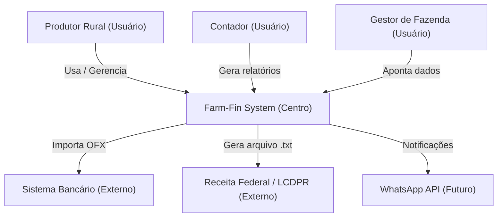
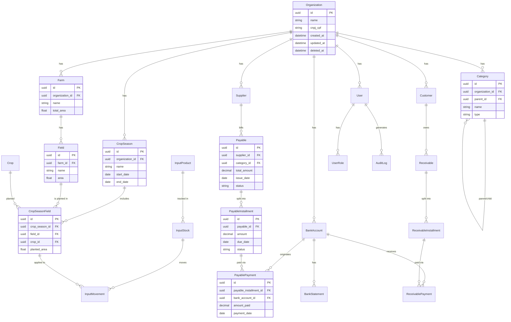
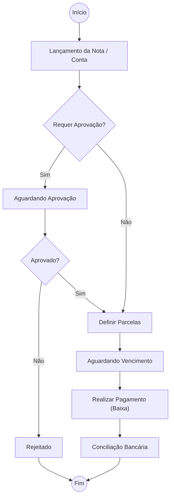
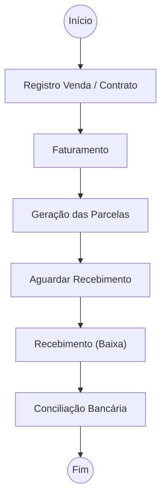
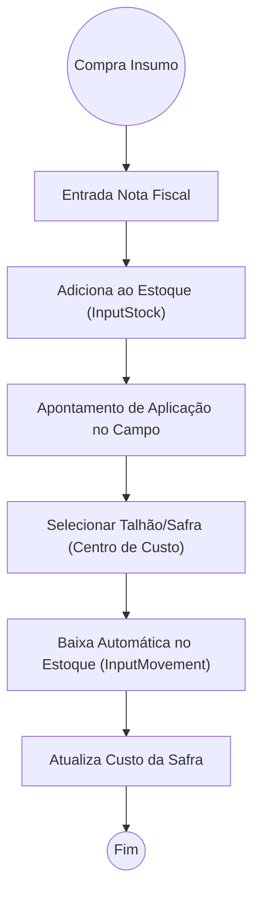
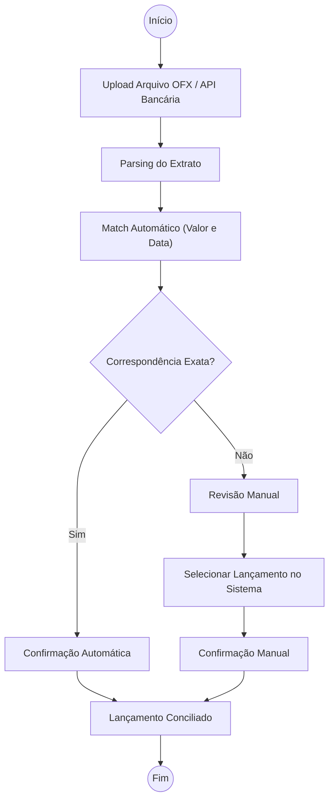
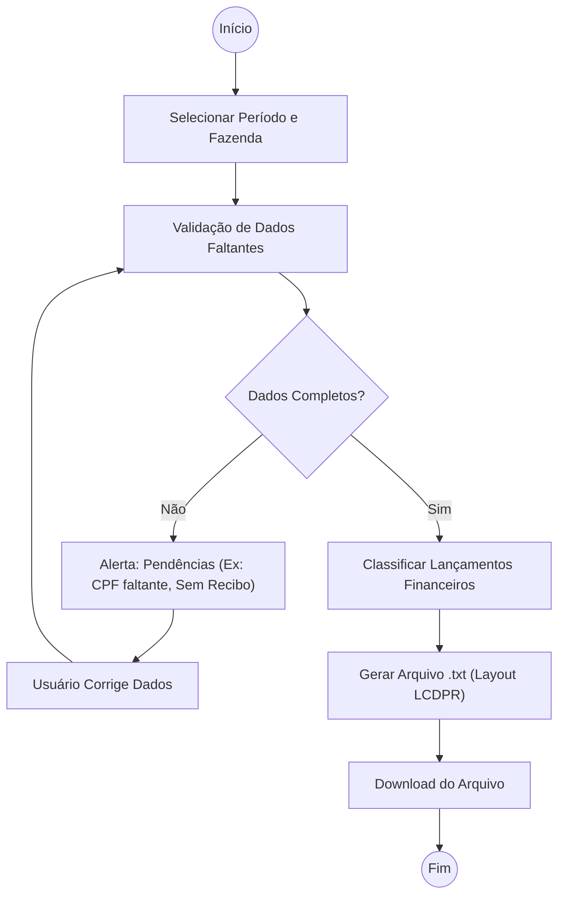
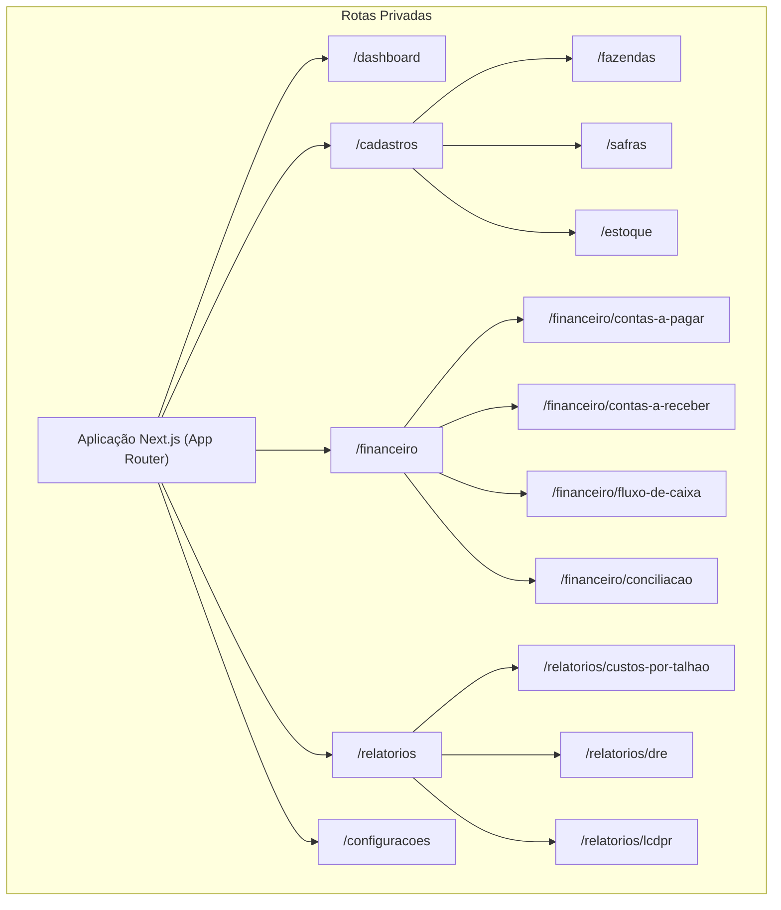
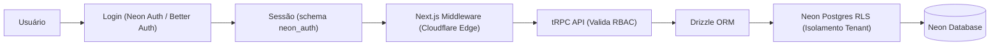
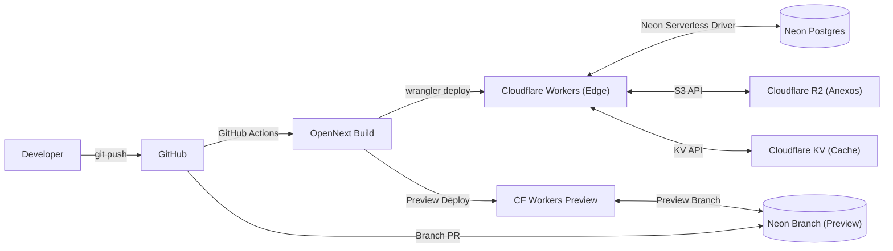

# Arquitetura Técnica: Farm-Fin

Documento de arquitetura do sistema Farm-Fin, um aplicativo de controle financeiro especializado para o agronegócio.

## 1. Visão Geral da Arquitetura

O sistema Farm-Fin adota uma arquitetura em camadas bem definida, garantindo separação de responsabilidades (Frontend → API → Services → Database).

**Stack Tecnológica:**
*   **Frontend:** Next.js 15+ (App Router) com TypeScript
*   **Backend:** Next.js API Routes + tRPC (ou REST)
*   **Banco de Dados:** Neon Postgres (Serverless) com Drizzle ORM
*   **Autenticação:** Neon Auth (Better Auth gerenciado) — `@neondatabase/auth`
*   **Deploy:** Cloudflare Workers via OpenNext adapter (`@opennextjs/cloudflare`)
*   **Storage:** Cloudflare R2 (compatível com S3)
*   **Cache:** Cloudflare KV / Workers Cache API
*   **Jobs:** Cloudflare Queues + Cron Triggers

### Por que essa stack?

| Decisão | Justificativa |
|---------|---------------|
| **Neon Postgres** | PostgreSQL serverless com scale-to-zero, branching de banco de dados (preview por PR), e autoscaling de compute. Sem servidor para gerenciar. |
| **Neon Auth** | Autenticação nativa no Postgres — dados de usuários/sessões vivem no schema `neon_auth` dentro do mesmo banco. Branchable identity: ao criar um branch do banco, o estado de auth é clonado junto. Construído sobre Better Auth (open source). |
| **Cloudflare Workers** | Deploy edge-first em 300+ localizações globais com cold starts sub-milissegundo. Via OpenNext adapter, suporta SSR, ISR, Server Actions e Middleware do Next.js 15+. |
| **Drizzle ORM** | ORM leve, type-safe, edge-compatible. Funciona nativamente em Cloudflare Workers (diferente do Prisma que requer engine binária). |
| **Cloudflare R2** | Object storage compatível com API S3, sem egress fees. Ideal para comprovantes, NFs e anexos. |

## 2. Diagrama de Contexto (C4 - Level 1)



## 3. Diagrama de Container (C4 - Level 2)

```mermaid
graph TD
    User["Usuários (Browser/Mobile)"]
    
    subgraph "Cloudflare Workers (Edge Global)" 
        WebApp["Next.js 15+ via OpenNext"]
        API["API Layer (tRPC / REST)"]
        Queues["Cloudflare Queues (Jobs Async)"]
        Cron["Cron Triggers (Alertas)"]
    end
    
    subgraph "Cloudflare Storage"
        R2["R2 Object Storage (Anexos/NFs)"]
        KV["KV Store (Cache/Sessions)"]
    end
    
    subgraph "Neon Platform"
        DB[("Neon Postgres (Serverless)")]
        NeonAuth["Neon Auth (Better Auth)"]
        AuthSchema["Schema: neon_auth"]
    end
    
    User <-->|HTTPS (Edge)| WebApp
    WebApp <-->|Internal Call| API
    
    API <-->|Drizzle ORM + Neon Serverless Driver| DB
    API <-->|@neondatabase/auth| NeonAuth
    NeonAuth <-->|Armazena em| AuthSchema
    AuthSchema -.->|Dentro de| DB
    
    API <-->|Upload/Download| R2
    API <-->|Cache/Rate Limit| KV
    
    Queues <-->|Process Async| DB
    Cron -->|Dispara| Queues
```

## 4. Modelo de Dados (ERD)



## 5. Diagramas de Fluxo (Flowcharts)

### 5.1 Fluxo de Contas a Pagar



### 5.2 Fluxo de Contas a Receber



### 5.3 Fluxo de Estoque de Insumos



### 5.4 Fluxo de Conciliação Bancária



### 5.5 Fluxo de Geração LCDPR



## 6. Diagrama de Componentes do Frontend



## 7. Estratégia de Dados

Para garantir robustez e segurança dos dados, o Farm-Fin adota as seguintes práticas:

*   **Identificadores:** UUIDs v4 como Primary Keys (`id`) em todas as tabelas para evitar enumeração e facilitar merges de dados off-line no futuro.
*   **Multi-tenancy:** Padrão "Shared Database, Shared Schema". Todas as entidades principais contêm a chave estrangeira `organization_id`. Todas as consultas na API filtram implicitamente por este ID.
*   **Soft Delete:** Nenhuma exclusão real de dados. Utilização de uma coluna `deleted_at` para manter o histórico e garantir integridade referencial contábil.
*   **Auditoria:** Colunas padronizadas (`created_at`, `updated_at`, `created_by`, `updated_by`). Mudanças críticas registram na tabela `AuditLog`.
*   **Performance:** Índices otimizados nas chaves estrangeiras, períodos de data (como vencimentos) e status das contas, para otimizar as queries mais frequentes de fluxo de caixa e relatórios.
*   **Branching:** Utilização de Neon Database Branching para ambientes de preview — cada pull request recebe um branch isolado do banco com dados e auth clonados automaticamente.

### 7.1 Neon Postgres — Detalhes

*   **Driver:** `@neondatabase/serverless` — driver HTTP/WebSocket otimizado para ambientes serverless e edge (Cloudflare Workers).
*   **ORM:** Drizzle ORM com `drizzle-orm/neon-serverless` adapter.
*   **Connection Pooling:** Neon Proxy com pooling nativo — sem necessidade de PgBouncer externo.
*   **Scale-to-Zero:** Compute desliga automaticamente após inatividade, cobrando apenas pelo uso real.
*   **Branching Workflow:**
    *   `main` → Branch de produção
    *   `dev` → Branch de desenvolvimento
    *   `preview/pr-{N}` → Branch efêmero por PR (criado via GitHub Actions)

## 8. Segurança

### 8.1 Autenticação — Neon Auth

O Farm-Fin utiliza **Neon Auth**, um serviço de autenticação gerenciado construído sobre o [Better Auth](https://www.better-auth.com/) (open source). Os dados de autenticação (usuários, sessões, configurações OAuth) residem no schema `neon_auth` dentro do próprio banco Neon Postgres.

**Métodos de login suportados:**
*   E-mail + Senha
*   Magic Link (e-mail)
*   OAuth (Google, Microsoft)
*   OTP via SMS (futuro)

**Vantagens-chave:**
*   **Branchable Identity:** Ao criar um branch do banco, o estado de auth é clonado — preview environments têm usuários de teste reais.
*   **Sem sync externo:** Não precisa de webhooks para sincronizar dados de usuário — eles já estão no banco.
*   **RLS nativo:** As sessões do `neon_auth` alimentam diretamente as políticas de Row Level Security.
*   **Portável:** Não há vendor lock-in — é possível migrar para Better Auth self-hosted a qualquer momento.

**SDK:**
```bash
npm install @neondatabase/auth
```

### 8.2 Autorização (RBAC)

*   Controle de acesso baseado em papéis (Admin, Gestor, Operador, Contador) através da entidade `UserRole`.
*   Middleware do Next.js verifica sessão Neon Auth e injeta o contexto de organização.
*   Cada API route valida permissões granulares antes de executar a operação.

### 8.3 Row Level Security (RLS)

*   Implementação de RLS diretamente no Neon Postgres.
*   As políticas utilizam o `user_id` da sessão Neon Auth para filtrar por `organization_id`.
*   Mesmo que haja falha no Backend, as políticas do banco impedem acesso cruzado entre tenants.

### 8.4 Proteção de APIs

*   Validação estrita de inputs no tRPC usando `zod`.
*   Rate Limiting via Cloudflare KV nas rotas públicas.
*   CORS restrito aos domínios da aplicação.



## 9. Deploy — Cloudflare Workers

O Farm-Fin é deployado na **Cloudflare Workers** utilizando o **OpenNext adapter** (`@opennextjs/cloudflare`), que compila a aplicação Next.js para o runtime Workers.

### 9.1 Por que Cloudflare Workers?

| Aspecto | Benefício |
|---------|----------|
| **Latência** | Sub-milissegundo cold starts, edge em 300+ cidades |
| **Compatibilidade** | Suporte completo a SSR, ISR, Server Actions, Middleware via OpenNext |
| **Custo** | Pay-per-request, sem servidores idle. Generous free tier (100k req/dia) |
| **Ecossistema** | R2 (storage), KV (cache), Queues (jobs), D1 (SQLite edge) integrados |
| **DDoS** | Proteção DDoS e WAF inclusos no plano |

### 9.2 Configuração

**Dependências:**
```bash
npm install -D @opennextjs/cloudflare wrangler
```

**`wrangler.jsonc`:**
```jsonc
{
  "$schema": "node_modules/wrangler/config-schema.json",
  "main": ".open-next/worker.js",
  "name": "farm-fin",
  "compatibility_date": "2026-08-01",
  "compatibility_flags": ["nodejs_compat"],
  "r2_buckets": [
    { "binding": "ATTACHMENTS", "bucket_name": "farm-fin-attachments" }
  ],
  "kv_namespaces": [
    { "binding": "CACHE", "id": "..." }
  ]
}
```

**Scripts de deploy:**
```json
{
  "scripts": {
    "dev": "next dev",
    "build": "npx @opennextjs/cloudflare build",
    "preview": "wrangler dev",
    "deploy": "wrangler deploy"
  }
}
```

### 9.3 Diagrama de Deploy


