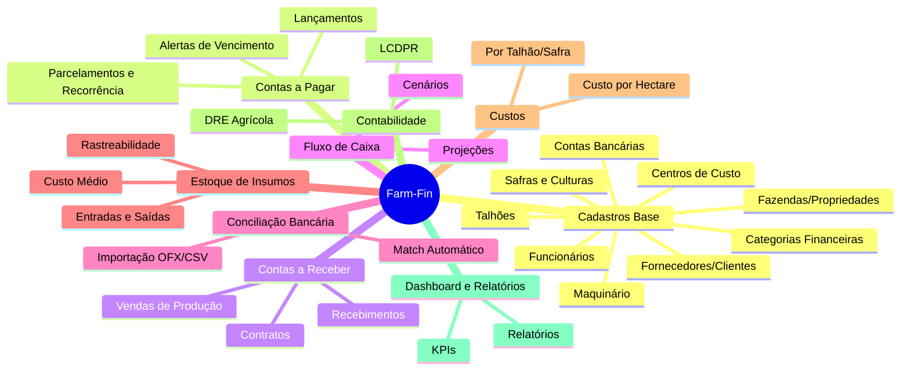

# Product Requirements Document (PRD) - Farm-Fin

## 1. Visão Geral do Produto

- **Nome**: Farm-Fin
- **Propósito**: Sistema de gestão financeira completo para o produtor rural brasileiro.
- **Público-alvo**: Produtores rurais de pequeno, médio e grande porte; gestores de fazendas; escritórios contábeis rurais.
- **Diferencial**: 100% focado nos workflows do agronegócio, com linguagem e fluxos que o produtor entende e utiliza no seu dia a dia.

## 2. Módulos do Sistema

### 2.1 Cadastros Base
- **Fazendas/Propriedades**: Suporte a múltiplas propriedades. Dados como localização, área total e CAR (Cadastro Ambiental Rural).
- **Talhões**: Unidades de produção dentro da fazenda. Cadastro com área em hectares, tipo de solo e coordenadas geográficas.
- **Safras**: Ciclos produtivos (ex: Safra 2025/2026, Safrinha 2026). Inclusão de cultura, variedade, datas de plantio e colheita previstas.
- **Culturas**: Soja, milho, algodão, café, cana-de-açúcar, pecuária, entre outros.
- **Centros de Custo**: Vinculação entre talhão + safra + cultura para alocação correta de despesas e receitas.
- **Fornecedores/Clientes**: Cadastro com dados completos, CNPJ/CPF, e categorias (ex: insumos, sementes, combustível, comprador de grãos, trading).
- **Categorias Financeiras**: Árvore hierárquica (ex: Insumos > Fertilizantes > NPK).
- **Maquinário**: Tratores, colheitadeiras, pulverizadores — controle de custo por hora/trabalhada.
- **Funcionários/Colaboradores**: Dados básicos, função, remuneração e custos adicionais.
- **Contas Bancárias**: Gerenciamento de múltiplas contas e saldos iniciais.

### 2.2 Contas a Pagar
- **Lançamento**: Manual e importação de documentos.
- **Vinculação Obrigatória**: Associação a centro de custo (talhão + safra), categoria financeira e fornecedor.
- **Status**: "Em aberto", "Parcialmente pago", "Pago", "Vencido", "Cancelado".
- **Condições**: Parcelamento automático (ex: 3x de R$ 10.000) e controle de recorrência (mensal, quinzenal).
- **Documentos**: Anexo de comprovantes, como Notas Fiscais e boletos.
- **Alertas**: Notificações de vencimento (7 dias, 3 dias, no dia, atrasado).
- **Baixa**: Manual ou automática via conciliação.
- **Filtros**: Por fornecedor, categoria, safra, talhão, status e período.

### 2.3 Contas a Receber
- **Lançamento**: Vendas de produção e serviços.
- **Vinculação**: Safra, cultura e comprador.
- **Contratos Especiais**: Suporte a contratos de venda antecipada, como barter e operações de hedge.
- **Recebimentos**: Gestão de parcelas e condições de pagamento.
- **Status**: "A receber", "Parcialmente recebido", "Recebido", "Atrasado".
- **Filtros**: Semelhantes ao Contas a Pagar.

### 2.4 Fluxo de Caixa
- **Visões**: Diária, semanal, mensal e anual.
- **Projeções**: Projeção de cenários futuros com base no contas a pagar e receber.
- **Saldos**: Saldo projetado por conta bancária.
- **Visualização**: Gráficos de evolução para análise de tendências.
- **Cenários**: Simulação de fluxos (otimista, realista, pessimista).

### 2.5 Conciliação Bancária
- **Importação**: Upload de arquivos OFX/CSV dos extratos bancários.
- **Match Automático**: Associação inteligente com os lançamentos de entrada e saída.
- **Conciliação Manual**: Tratamento para itens não identificados automaticamente.
- **Conferência**: Comparação contínua entre saldo conferido e saldo registrado no sistema.

### 2.6 Controle de Estoque de Insumos
- **Movimentações**: Entrada via nota fiscal ou inclusão manual.
- **Baixas**: Saída vinculada diretamente à aplicação no talhão específico.
- **Saldos e Custos**: Saldo atualizado por produto e cálculo do custo médio ponderado.
- **Alertas**: Notificações de estoque mínimo.
- **Qualidade**: Rastreabilidade por lote e data de validade.

### 2.7 Custo por Talhão/Safra
- **Consolidação**: Soma automática de todos os custos alocados a uma cultura, safra e talhão.
- **Métricas**: Custo por hectare.
- **Comparações**: Comparativo de desempenho financeiro entre talhões e histórico entre safras.
- **Breakdown de Custos**: Detalhamento em insumos, mão de obra, maquinário e despesas gerais (overhead).

### 2.8 DRE Agrícola (Demonstrativo de Resultado do Exercício)
- **Estrutura**:
  - Receitas de venda da produção
  - (-) Custos diretos (insumos, mão de obra, maquinário)
  - (-) Custos indiretos (overhead, administração)
  - (=) **Margem Bruta**
  - (-) Despesas operacionais
  - (=) **Resultado Operacional**
- **Filtros Flexíveis**: Análises por safra, talhão, cultura e período específico.

### 2.9 LCDPR (Livro Caixa Digital do Produtor Rural)
- **Conformidade**: Registro padronizado conforme o layout 1.3 exigido pela Receita Federal.
- **Exportação**: Geração automática do arquivo .txt para envio no e-CAC.
- **Classificação**: Categorização precisa por tipo de lançamento (receitas, despesas de custeio/investimento).
- **Legislação**: Destaca obrigatoriedade para produtores com faturamento anual igual ou superior a R$ 4.800.000,00.
- **Composição**: Suporte a condomínios e parcerias rurais com cálculo de rateio.

### 2.10 Dashboard e Relatórios
- **Dashboard Principal (KPIs)**: Saldo atualizado, contas vencidas a pagar e receber, receita do mês, despesa do mês, margem por safra ativa.
- **Relatórios Gerenciais**:
  - Aging de contas a pagar/receber
  - Fluxo de caixa previsto x realizado
  - Custos operacionais por talhão
  - DRE detalhado por safra
- **Visualização**: Gráficos interativos com opções de drill-down.

## 3. Requisitos Não-Funcionais
- **Usabilidade**: App web responsivo, com abordagem mobile-first facilitando o uso diretamente no campo.
- **Disponibilidade**: Modo offline para lançamentos básicos em áreas sem cobertura, com sincronização automática (sync) ao reestabelecer conexão.
- **Arquitetura**: Sistema Multi-tenant (suporte a múltiplas fazendas ou grupos agrícolas).
- **Stack**: Next.js 15+ no Cloudflare Workers (edge global), Neon Postgres (serverless), Neon Auth (Better Auth), Drizzle ORM, Cloudflare R2/KV.
- **Segurança de Acesso**: Controle restrito de acesso por perfil (Proprietário, Gestor, Financeiro, Contador, Operador de Campo) via Neon Auth + RBAC.
- **Auditoria**: Log detalhado e trilha de auditoria (quem fez o quê e quando).
- **Dados**: Neon Postgres com branching para ambientes de preview. Backup automático gerenciado pela plataforma.
- **Performance**: Dashboard deve carregar em < 2s. Deploy edge (300+ cidades) com cold starts sub-milissegundo.
- **Segurança e Privacidade**: HTTPS, Row Level Security no Neon Postgres, criptografia de dados sensíveis, autenticação via Neon Auth com suporte a Magic Link, OAuth e 2FA.

## 4. Integrações Futuras (Roadmap)
- **WhatsApp**: Envio de alertas de vencimento e resumos financeiros diários/semanais.
- **Bancos (Open Finance)**: Iniciação de pagamentos PIX de forma automática diretamente no sistema.
- **Fisco**: Importação direta de notas fiscais eletrônicas (XML) a partir da SEFAZ.
- **Agricultura de Precisão**: Integração de dados de sensores IoT de máquinas e clima.
- **Ecossistema Mobile**: Lançamento de aplicativo mobile nativo (iOS e Android).

## 5. Personas

- **Seu Antônio (Pequeno produtor, 50ha soja/milho)**: Valoriza a simplicidade, facilidade de uso, botões grandes e termos claros. Não tem formação contábil e precisa que o sistema faça o trabalho pesado por ele.
- **Marina (Gestora de fazenda 5.000ha)**: Focada em performance e análise. Precisa de relatórios muito detalhados, controle rigoroso do custo por hectare e visões amplas do fluxo de caixa e projeções financeiras.
- **Carlos (Contador rural com 20 clientes produtores)**: Exige compliance. Precisa de acessos ágeis para multi-fazendas, integração rápida do LCDPR para evitar multas, facilidade em auditar documentos e baixar extratos conciliados.
